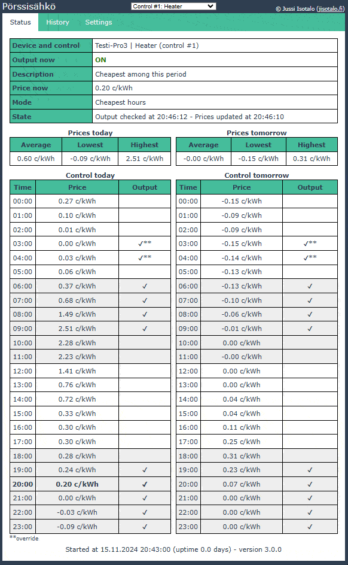
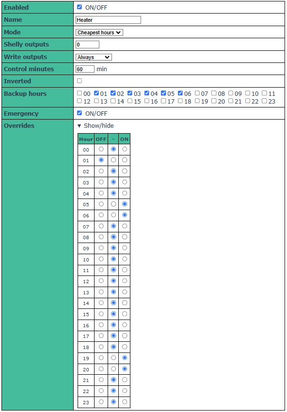
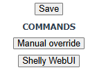

# shelly-porssisahko - Nordpool electricity spot price control for Shelly devices
[](https://choosealicense.com/licenses/agpl-3.0/)
[](https://github.com/jisotalo/shelly-porssisahko-en)

*Pörssisähkö: a Finnish word for electric spot price*

A free open source script for Shelly devices to control outputs by Nordpool electricity spot price. Script runs its own web server and saves its settings to Shelly's memory. Fully configured and monitored using a web browser.

Script uses API by [Elering](https://dashboard.elering.ee/api) without any other services. No need to register anywhere, it just works.

If you want to control the color of Shelly Plug Plus LED by electricity price, see [shelly-plug-nordpool-light](https://github.com/jisotalo/shelly-plug-nordpool-light).

--- 

**SUOMEKSI:** Skriptistä on suomenkielinen versio osoitteessa [https://github.com/jisotalo/shelly-porssisahko](https://github.com/jisotalo/shelly-porssisahko). 

---



## Features
* Free and open source
* Own web server and a web-based user interface
* No registeration
* Monitoring and configuration with a web browser in local network (PC, phone, tablet)
* Possible to create up to three different controls using their own rules
* Prices and control status for today and tomorrow
* Three different operation modes
* Possibility to control only part of an hour, e.g. first 30 minutes
* Temporary manual override or configurable overrides for specific hours
* Fault-tolerant
  * Backup hours configurable (if no prices available but time is known)
  * Emergency (if no internet connection and no known time)
* Possible to configure and extend by user scripts

## Table of contents
- [shelly-porssisahko - Nordpool electricity spot price control for Shelly devices](#shelly-porssisahko---nordpool-electricity-spot-price-control-for-shelly-devices)
  - [Features](#features)
  - [Table of contents](#table-of-contents)
  - [Changelog](#changelog)
  - [Support](#support)
  - [Installation](#installation)
    - [Install using a library (recommended)](#install-using-a-library-recommended)
    - [Install manually](#install-manually)
  - [Updating script](#updating-script)
  - [Shelly devices](#shelly-devices)
  - [Settings](#settings)
    - [Common settings](#common-settings)
    - [Control settings](#control-settings)
      - [General](#general)
      - [Manual mode](#manual-mode)
      - [Price limit](#price-limit)
      - [Chepeast hours](#chepeast-hours)
    - [Chepeast hours - custom periods](#chepeast-hours---custom-periods)
    - [Commands](#commands)
  - [Addditional features by user scripts](#addditional-features-by-user-scripts)
    - [User script features](#user-script-features)
    - [Adjusting settings with a separate script (remotely)](#adjusting-settings-with-a-separate-script-remotely)
  - [FAQ](#faq)
    - [How reliable is this script?](#how-reliable-is-this-script)
    - [Why I sometimes get HTTP error 503?](#why-i-sometimes-get-http-error-503)
    - [Why the device name says "not set"?](#why-the-device-name-says-not-set)
    - [How to use with Switch Add-On?](#how-to-use-with-switch-add-on)
    - [When the script reads the prices for tomorrow?](#when-the-script-reads-the-prices-for-tomorrow)
    - [Where are the settings saved to?](#where-are-the-settings-saved-to)
    - [Why there is no price data?](#why-there-is-no-price-data)
    - [Why is the history length so short?](#why-is-the-history-length-so-short)
  - [Technical info](#technical-info)
    - [General](#general-1)
    - [Building the script](#building-the-script)
  - [License](#license)

## Changelog

 See [CHANGELOG.md](https://github.com/jisotalo/shelly-porssisahko-en/blob/master/CHANGELOG.md) for version history.

Old version can be found from [Releases](https://github.com/jisotalo/shelly-porssisahko-en/releases). Download the desired version archive and copy the contents of `dist/shelly-porssisahko.js`.

## Support

If this script is useful, you might want to buy me a coffee! This is purely a hobby project.

<a href="https://www.buymeacoffee.com/jisotalo" target="_blank"></a>

[](https://www.paypal.com/donate/?business=KUWBXXCVGZZME&no_recurring=0&currency_code=EUR)
 
## Installation

### Install using a library (recommended)

1. Install Shelly, connect it to a WiFi and update its firmware. Older versions aren't supported.
2. Open Shelly Web UI **with a web browser**
3. Open **Scripts** page
4. Click **Library** button

    

5. Click **Configure URL**.
6. Enter address `https://raw.githubusercontent.com/jisotalo/shelly-porssisahko-en/master/shelly-library.json` and click **Save**.

    

7. Now the scripts are available. Install the topmost script (full features) by clicking **Import code**.

    

1. When the code appears, click **Save**.

    

2.  Enable websocket debug by clicking **Enable**. This is important to see the URL and logs. This needs to be done only once.

    

3. Click **Start**

    

4.  Now you will see the URL address of the script control panel. Copy it and open in a new tab. Address is similar to `http://ip-osoite/script/1`.

    

5. Go back to scripts page and toggle **Run on startup**

    

6. Ready! Open the control panel in web browser (see step 11) and adjust the settings.

### Install manually

If you want to install manually, with the Shelly Smart Control app or [control.shelly.cloud](https://control.shelly.cloud), you can download the script from the following URL:

[https://raw.githubusercontent.com/jisotalo/shelly-porssisahko-en/master/dist/shelly-porssisahko.js](https://raw.githubusercontent.com/jisotalo/shelly-porssisahko-en/master/dist/shelly-porssisahko.js). 

## Updating script

If you want to update the script to a newer one, delete the active script and install the new using **Library** button.

All settings will be kept.

After installing, check that **Run on startup** is active.

## Shelly devices

At least these devices have been usesd successfully:

  * Shelly Plus 1PM
  * Shelly Plus 2PM
  * Shelly Plus 1
  * Shelly Pro 1
  * Shelly Pro 2
  * Shelly Pro 3
  * Shelly Pro 4PM
  * Shelly Pro3EM + Switch Add-on
  * Shelly Plus UNI
  * Shelly Plus 1 Mini
  * Shelly Plus Plug S
    * For color control, see [shelly-plug-nordpool-light](https://github.com/jisotalo/shelly-plug-nordpool-light)

## Settings

The script has up to three different controls that can be configured separately.
This allows controlling different outputs with separate rules on Shelly Pro devices. 

The active control is selected from the dropdown menu located on the top.
The UI displays status, history and settings for the selected control.


### Common settings

These are in common for all controls.


| Setting       | Description                                                      | Example (figure above)   |
| ------------- | ---------------------------------------------------------------- | ------------------------ |
| Country       | Country to get prices for (Finland, Estonia, Latvia, Lithuania). | `Finland`                |
| VAT           | VAT-% t to add to electricity prices. [%]                        | `25.5`                   |
| Transfer fees | Transfer feeds added to electricity price (optional). [c/kWh]    | day: `4` <br> night: `3` |


### Control settings

These settings are separate for each control.



#### General

| Setting         | Description                                                                                                                                                                                                                                                                                                                            | Example (figure above)                                               |
| --------------- | -------------------------------------------------------------------------------------------------------------------------------------------------------------------------------------------------------------------------------------------------------------------------------------------------------------------------------------- | -------------------------------------------------------------------- |
| Enabled         | Is the control in use.                                                                                                                                                                                                                                                                                                                 | `ON`                                                                 |
| Name            | Freely given name for the control.                                                                                                                                                                                                                                                                                                     | `Heater`                                                             |
| Mode            | Control mode to use.<br><br>See below for more.                                                                                                                                                                                                                                                                                        | `cheapest hours`                                                     |
| Shelly outputs  | ID numbers of Shelly outputs to use.<br><br>If multiple, use comma to separate (max 4).<br><br>- One output  (Shelly Plus 1 etc.) --> `0`.<br>- Multiple (e.g. 0, 1 and 100) --> `0,1,100`                                                                                                                                             | `0`                                                                  |
| Write outputs   | Is the output written always or only when it's changed.<br><br>- **Always:** Output is commanded always after running the logic (every hour or so). All changes from elsewhere (Shelly App etc.) are overwritten.<br>- **Only when changed:** Output is commanded only if it has changed compared to the result of previous logic run. | `always`                                                             |
| Control minutes | Number of minutes of a hour to use. For example, if 30 minutes is always enough for heating, the output will be turned off after time has passed.                                                                                                                                                                                      | `60`                                                                 |
| Inverted        | If checked, the output is inverted. For example, if the active hour is among cheapest ones, output is set OFF.                                                                                                                                                                                                                         | `no`                                                                 |
| Backup hours    | If the electricity price is unknown and Shelly knows the active time, these hours are used instead.                                                                                                                                                                                                                                    | `01:00-07:00`                                                        |
| Emergency       | If Shelly doesn't know the active time, the output is set to this value                                                                                                                                                                                                                                                                | `ON`                                                                 |
| Overrides       | Can be used to set the output ON or OFF always on certain hours (no matter what is the price)                                                                                                                                                                                                                                          | at `05:00-07:00` and at `19:00-21:00` ON<br><br>at `01:00-02:00` OFF |

#### Manual mode

Used if the active mode is **manual**.

The output is commanded to the value selected.


| Setting | Description                 | Example (figure above) |
| ------- | --------------------------- | ---------------------- |
| Output  | Is the output set OFF or ON | `ON`                   |

#### Price limit

Used if the active mode is **price limit**.

In this mode, the output is set ON if electricity price is at or below the configured limit.


| Setting     | Description                                                                                                   | Example (figure above) |
| ----------- | ------------------------------------------------------------------------------------------------------------- | ---------------------- |
| Price limit | Price at or below the output is set ON. [c/kWh]<br><br>You can enter `avg` to use daily average as the limit. | `4.25`                 |

#### Chepeast hours

Used if the active mode is **cheapest hours**.

In this mode, the day is divided into periods. The output is set ON during the cheapest hours of each period.

Day can be divided into equal periods (e.g. every 8h) or you can enter custom time ranges (e.g. morning and evening).


| Setting          | Description                                                                                                                                                                                           | Example (figure above) |
| ---------------- | ----------------------------------------------------------------------------------------------------------------------------------------------------------------------------------------------------- | ---------------------- |
| Time period      | What kind of periods to divide the day into. Cheapest hours are selected from each period. [h]<br><br>You can also select `custom`.                                                                   | `6`                    |
| Hour count       | Number of cheapest hours to select.<br><br>If the period is 6h and hour count is 2h, between 00:00-06:00 the output is set ON during the two cheapest hours. Same thing during 06:00-12:00 and so on. | `2`                    |
| Sequential       | If checked, the hours are selected so that cheapest sequential hours are used (so single cheapest hours might not be selected in all cases)                                                           | `no`                   |
| Always on limit  | If electricity price is at or below this limit, the output is always ON. [c/kWh]<br><br>You can enter `avg` to use daily average as the limit.                                                        | `-0.5`                 |
| Max. price limit | If electricity is over this limit, the output is always OFF. [c/kWh]<br><br>You can enter `avg` to use daily average as the limit.<br><br>*Be careful with this one....*                              | `30`                   |

See example below for results using settings above (prices at 12.10.2023, Finnish version). Note the usage of background color to highlight periods.


The following figures demonstrate the **sequential** setting. The examples have 4h period and hour count of 3.

**Not checked (default):**

Selecting three cheapest hours.


**Checked:**

Selecting three sequential hours. The 17-19 is selected as the total average is lower than 16-18.


### Chepeast hours - custom periods

It's also possible to enter one or two custom periods with  custom hour count for each. 
This can be used to achieve a common use case "*three cheapest hours during the night 00-06 and the cheapest hour in the evening during 18-21*".

If the period is selected as `custom`, the time periods can be entered manually.


See the figure below for example operation for above setting (Finnish version).

 

### Commands



* **Manual override**
  * Allows overriding output for certain period of time to ON or OFF
  * Enter length of the override as hours (you can use decimals,  `0.5` = ½ hour)
* **Shelly Web UI**
  * Open Shelly Web UI in a new tab

## Addditional features by user scripts

User scripts can be used to add features. See some examples below.

| Script                                                                                                                                             | Description                                                                                                                                                                                                                                                                        |
| -------------------------------------------------------------------------------------------------------------------------------------------------- | ---------------------------------------------------------------------------------------------------------------------------------------------------------------------------------------------------------------------------------------------------------------------------------- |
| [`shelly-porssisahko-open-meteo-api.js`](https://github.com/jisotalo/shelly-porssisahko/blob/master/dist/shelly-porssisahko-open-meteo-api.js)     | Fetches coldest temperature for the day and uses it to adjust number of cheapest hours                                                                                                                                                                                             |
| [`shelly-porssisahko-addon-temp-hours.js`](https://github.com/jisotalo/shelly-porssisahko/blob/master/dist/shelly-porssisahko-addon-temp-hours.js) | Adjusts number of cheapest hours based on Shelly Plus Addon temperature measurement                                                                                                                                                                                                |
| [`shelly-porssisahko-addon-temp.js`](https://github.com/jisotalo/shelly-porssisahko/blob/master/dist/shelly-porssisahko-addon-temp.js)             | Overrides the output based on Shelly Plus Addon temperature measurement, if needed.                                                                                                                                                                                                |
| [`shelly-porssisahko-ht-sensor-temp.js`](https://github.com/jisotalo/shelly-porssisahko/blob/master/dist/shelly-porssisahko-ht-sensor-temp.js)     | Adjusts number of cheapest hours based on Shelly H&T temperature measurement                                                                                                                                                                                                       |
| [`shelly-porssisahko-config.js`](https://github.com/jisotalo/shelly-porssisahko/blob/master/dist/shelly-porssisahko-config.js)                     | Script that is installed in parallel to the main script. Used to adjust settings without access to the control panel (e.g. remotely with Shelly Smart Control app) See [Adjusting settings with a separate script (remotely)](#adjusting-settings-with-a-separate-script-remotely) |

### User script features

Script calls the following functions if they are available. See above scripts for examples.

<small>

| Function        | Signature                                                                        | Parameters                                                                                                | Description                                                                                                                                                                |
| --------------- | -------------------------------------------------------------------------------- | --------------------------------------------------------------------------------------------------------- | -------------------------------------------------------------------------------------------------------------------------------------------------------------------------- |
| `USER_CONFIG`   | `USER_CONFIG(inst: number, initialized: boolean) => void`                        | `inst` = control instance index (`0, 1, 2`)<br>`initialized` = settings have changed                      | Called when settins have changed and when the logic will be run. Can be used to change settings.                                                                           |
| `USER_OVERRIDE` | `USER_OVERRIDE(inst: number, cmd: boolean, callback: function(boolean)) => void` | `inst` = control instance index (`0, 1, 2`)<br>`cmd` = original command<br>`callback` = callback function | Called when logic has been run. The output by the logic can be overwritten before the output is commanded. The `callback()` **needs to be called** with final output value |
| `USER_LOOP`     | `USER_LOOP() => void`                                                            |                                                                                                           | Called from the script main loop if the script isn't doing anything (every 10s) The `loopRunning = false` needs to be set when finished.                                   |

</small>

### Adjusting settings with a separate script (remotely)

This method can be used to change settings remotely outside the local network (Shelly Smart Control app etc.)


1. Install with the library or manually [`shelly-porssisahko-config.js`](https://github.com/jisotalo/shelly-porssisahko-en/blob/master/dist/shelly-porssisahko-config.js) in parallel to the main script (keep main script running).
2. Remove comments (`//`) from the settings you want to adjust. All others are kept as-is.
3. Click **save** and start the script. It will stop automatically.

Example: Adjusting number of cheapest hours to `8h`.


## FAQ

### How reliable is this script?

The target is to create a script that can be installed once and then forgotten.

Personally, the v.2 has been running nicely for over 100 days straight.


### Why I sometimes get HTTP error 503?

The script will answer with 503 when it's doing something (to save memory).

Try again.

### Why the device name says "not set"?

You haven't set a custom name for device. It can be set from Shelly Web UI: `Settings` -> `Device name`.

### How to use with Switch Add-On?

Tested with Shelly Pro3EM + Switch Add-on.

You will see the output number in Shelly control panel. In this example, it's `100`.


Use that value as `Shelly outputs` setting in this script.

### When the script reads the prices for tomorrow?

At 15:00 - Elering offers the new prices at around 14:30.

### Where are the settings saved to?

Shelly KVS memory (Advanced -> KVS). They are as JSON and can be freely edited manually.

Script needs to be restarted for the changes to take effect. 


### Why there is no price data?

Sometimes Elering might have API issues. This is what the backup hours are for.

Check Shelly diagnostics log and try again later.

### Why is the history length so short?

24 last control changes are saved to history to save memory.

- One control in use -> 24 last changes
- Two controls in use -> 12 last changes each
- Three controls in use -> 8 last changes each

## Technical info

### General

* Shelly is low on memory so many things are done in an ugly manner
* Some variables are at global scope because Shelly js engine stack issues
* The final script is done by "building" (minimizing, base64 encoding, gzipping)
* Use [Eleringin CSV API](https://dashboard.elering.ee/assets/api-doc.html#/nps-controller/getPriceAsCSVUsingGET) to save memory (instead of JSON)
* v. 3.0.0 uses around 18kb of Shelly memory (plenty of space left for other scripts)

```
script:1: {
  id: 1,
  running: true,
  mem_used: 11900,
  mem_peak: 18116,
  mem_free: 13286
},
```

### Building the script

1) Install Node.js 
2) Clone repository and open terminal in `shelly-porssisahko` folder
3) Run `npm i`
4) Run `npm run build`
5) Scripts are generated to `dist/`

## License

GNU Affero General Public License v3.0 - [LICENSE.txt](https://github.com/jisotalo/shelly-porssisahko-en/blob/master/LICENSE.txt)

Note that there is no warranty, use at your own risk. Tab system is based on [this example](https://alvarotrigo.com/blog/html-css-tabs/).